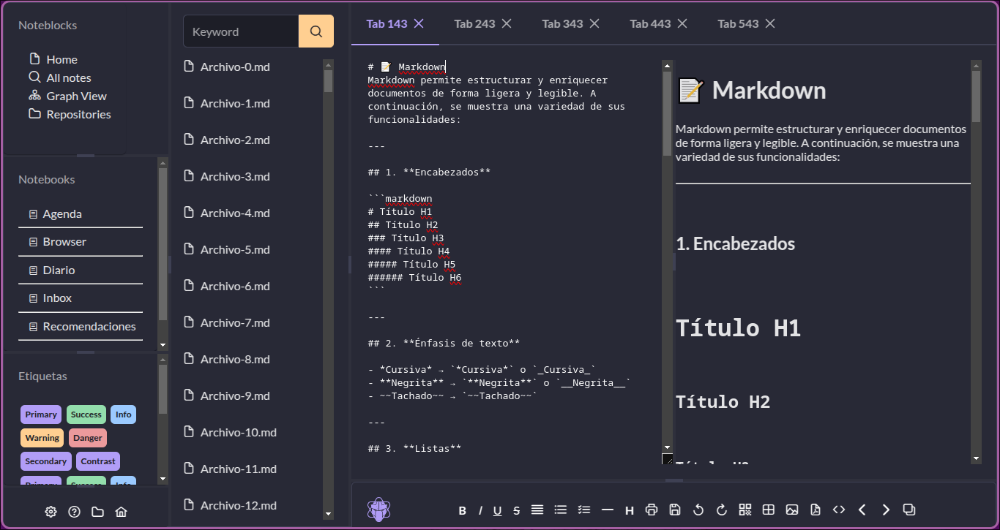

const [files, setFiles] = useState([]);

  useEffect(() => {
    window.api.getFiles('/home/darkplayer/Documentos/Notas').then(setFiles);
  }, []);

  <Splitter size={100} layout='vertical'>
            <SplitterPanel className="flex align-items-center justify-content-center" size={20} minSize={10}>
              
            </SplitterPanel>
            <SplitterPanel className="flex align-items-center justify-content-center" size={80}>
              <Splitter >
                <SplitterPanel className="flex align-items-center justify-content-center" size={50} minSize={50}>
                  
                </SplitterPanel>
                <SplitterPanel style={{ overflowX: "scroll" }} className="flex align-items-center justify-content-center" size={50}>
                  
                </SplitterPanel>

              </Splitter>
            </SplitterPanel>
          </Splitter>